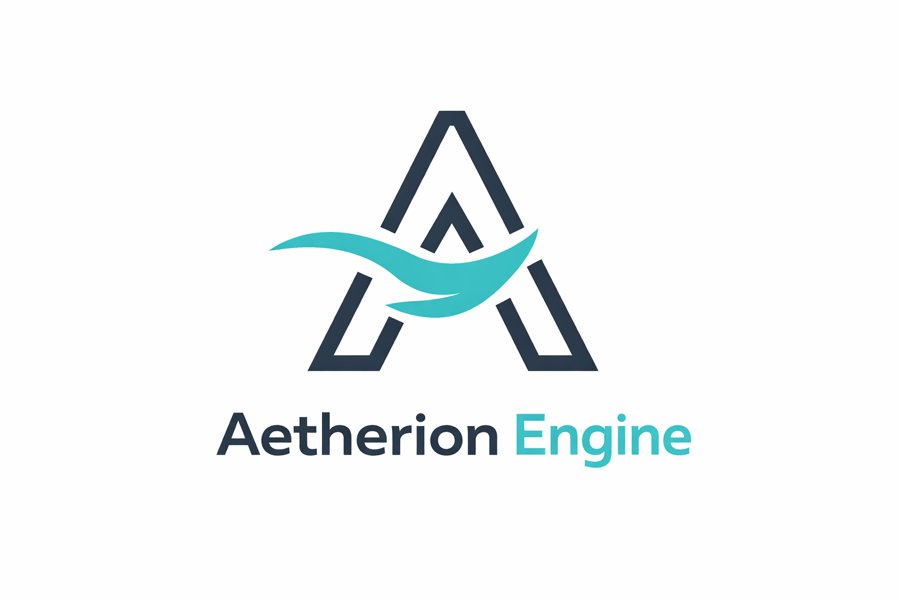

# Aetherion Engine



Aetherion is a modular, editor-driven engine written in modern C++ (C++20) with a Qt 6 editor and a Vulkan-based renderer.

This repo is no longer just a UI/architecture scaffold: it contains a working editor application, a runtime library, Vulkan rendering code, shader compilation, and an initial asset/scene workflow. The project is still early/WIP and APIs may change frequently.

## Layout

```text
/Aetherion
├─ /Engine
│  ├─ /Core
│  ├─ /Runtime
│  ├─ /Editor
│  ├─ /Scene
│  ├─ /Assets
│  ├─ /Platform
│  ├─ /Rendering    // Vulkan renderer + viewport
│  ├─ /Physics      // currently placeholder
│  ├─ /Audio        // currently placeholder
│  └─ /Scripting    // currently placeholder
├─ /CMake
├─ CMakeLists.txt
└─ README.md
```

## Current Features (WIP)

- **Editor (Qt 6 Widgets)**: dockable panels, scene viewport, hierarchy, inspector.
- **Viewport navigation**: mouse rotate/zoom + keyboard movement (WASD/QE).
- **Assets**: asset registry scanning + asset browser UI.
- **Meshes**: basic glTF mesh loading path (positions/indices + vertex colors).
- **Mesh Preview**: dock panel that renders the currently selected mesh.
- **Vulkan**: swapchain, render pass, uniform buffers, and a minimal render loop.

## Building

This project uses CMake and Qt 6 (Widgets). Below are platform-specific steps.

### Prerequisites

- CMake 3.21+
- A C++20 compiler
- Qt 6 (Widgets)
- Vulkan SDK (required): headers + loader + **glslangValidator** for shader compilation

### Windows (MinGW)

Prerequisites:

- Qt 6 MinGW (e.g. installed under `C:/Qt/6.9.1/mingw_64`)
- MinGW toolchain from Qt Tools (e.g. `C:/Qt/Tools/mingw1310_64`)
- Vulkan SDK (e.g. `C:/VulkanSDK/<version>`)

Build and run:

```powershell
$env:PATH = "C:\\Qt\\Tools\\mingw1310_64\\bin;C:\\Qt\\6.9.1\\mingw_64\\bin;" + $env:PATH
$env:VULKAN_SDK = "C:/VulkanSDK/<version>"   # adjust
cmake -S . -B build-mingw -G "MinGW Makefiles" -DQt6_DIR="C:/Qt/6.9.1/mingw_64/lib/cmake/Qt6" -DCMAKE_CXX_COMPILER="C:/Qt/Tools/mingw1310_64/bin/g++.exe"
cmake --build build-mingw -- -j 8
./build-mingw/AetherionEditor.exe
```

### Windows (MSVC)

Install Qt for `msvc2022_64` and use Visual Studio generator:

```powershell
$env:VULKAN_SDK = "C:/VulkanSDK/<version>"   # adjust
cmake -S . -B build-msvc -G "Visual Studio 17 2022" -DQt6_DIR="C:/Qt/6.9.1/msvc2022_64/lib/cmake/Qt6"
cmake --build build-msvc --config Debug
./build-msvc/Debug/AetherionEditor.exe
```

### macOS (Homebrew)

```bash
brew install qt
brew install vulkan-headers vulkan-loader glslang
cmake -S . -B build -DQt6_DIR="$(brew --prefix qt)/lib/cmake/Qt6"
cmake --build build -- -j 8
./build/AetherionEditor
```

The build produces:

- `AetherionRuntime` (static library)
- `AetherionEditor` (Qt 6 Widgets executable)

Shader compilation outputs SPIR-V into `build-*/shaders/`.

## Dependencies

- CMake 3.21+ and a C++20 compiler
- Qt 6 (Widgets module) development packages
- Vulkan SDK (headers + loader + shader tools)
- Optional future modules: physics/audio/scripting integrations

## Notes

- The project is actively evolving during the transition to a 3D engine.        
- Some subsystems are still placeholders (physics/audio/scripting), while rendering + editor are already functional.
- Expect breaking changes while core systems solidify.

## Rendering Notes

Color space policy:
- Albedo textures are loaded as sRGB and sampled as linear for lighting.
- Lighting stays in linear space; scene color targets are linear formats.
- Postprocess applies ACES tonemapping; gamma is only applied when the swapchain is not sRGB.

Debug, picking, and profiling APIs:
- `VulkanViewport::SetDebugViewMode(DebugViewMode::Final/Normals/Roughness/Metallic/Albedo/Depth/EntityId)`.
- `VulkanViewport::RequestPick(x, y)` + `GetLastPickResult()` for ID-buffer picking (`SetPickFlipY(true)` if needed).
- `VulkanViewport::GetLastFrameStats()` returns CPU/GPU timings per pass.
