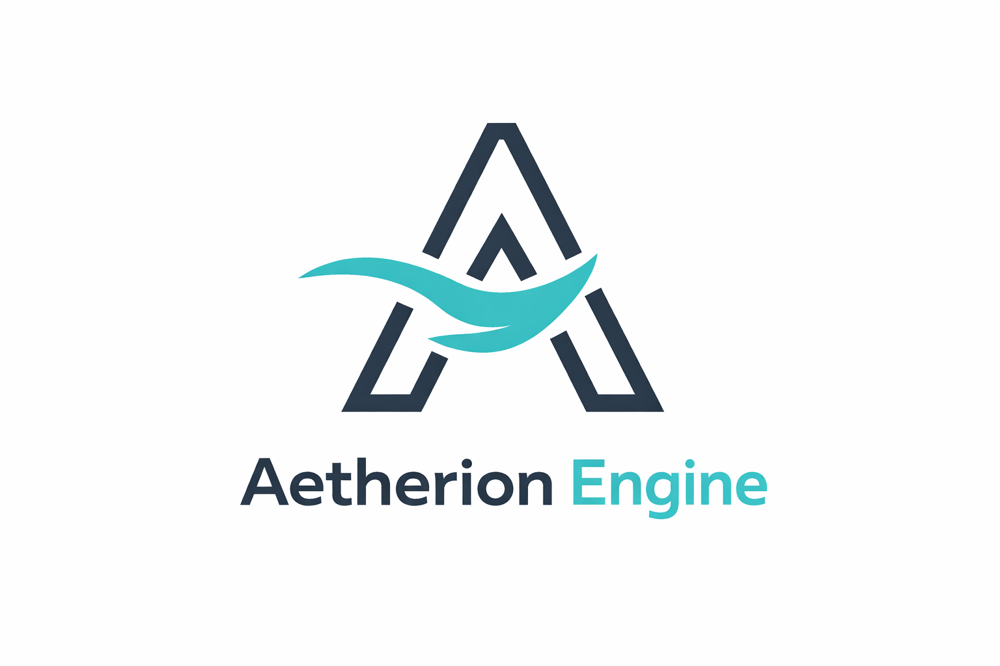

# Aetherion Engine



Aetherion is a modular, editor-driven engine written in modern C++ (C++20) with a Qt 6 editor and a Vulkan-based renderer.

This repo contains a working editor application, a runtime library, Vulkan rendering code, shader compilation, and an initial asset/scene workflow. It is actively evolving with new AI-native features and subsystems.

## Documentation

- [Feature Plan & Roadmap](docs/feature-plan.md)
- [AI Native Roadmap](docs/AI_NATIVE_ROADMAP.md)
- [Asset Pipeline](docs/asset-pipeline.md)
- [Agentic Copilot Workflow](docs/agentic-workflow.md)

## Layout

```text
/Aetherion-Engine
├─ /assets          // Source assets (icons, meshes, scenes)
├─ /build           // Build output (created by CMake)
├─ /docs            // Project documentation
├─ /Engine
│  ├─ /Assets       // Asset management & registry
│  ├─ /Audio        // Miniaudio integration
│  ├─ /Core         // Base types, UUIDs, Logging
│  ├─ /Editor       // Qt 6 Widgets application & panels
│  ├─ /Physics      // Jolt Physics integration
│  ├─ /Platform     // OS abstractions
│  ├─ /Rendering    // Vulkan renderer, RHI, shaders
│  ├─ /Runtime      // Runtime application logic
│  ├─ /Scene        // ECS (Entities, Components, Systems)
│  ├─ /Scripting    // Scripting interfaces (WIP)
│  └─ /ThirdParty   // External libs (Jolt, miniaudio, etc.)
├─ /tools           // Python/Shell scripts for workflow
├─ CMakeLists.txt
└─ README.md
```

## Current Features

- **Editor (Qt 6 Widgets)**: Dockable panels, scene viewport, hierarchy, inspector.
- **AI Copilot**: Integrated AI chat panel for editor assistance.
- **Viewport**: Mouse rotate/zoom + keyboard movement (WASD/QE), picking support.
- **Rendering (Vulkan)**: 
  - Forward renderer with PBR basics.
  - glTF mesh loading.
  - Shader management & SPIR-V compilation.
- **Physics**: Integrated **Jolt Physics** (Rigidbodies, Colliders, Gravity).
- **Audio**: Integrated **miniaudio** (Basic one-shot playback).
- **Assets**: Asset registry, scanning, and browser UI.

## Tools

The `tools/` directory contains helper scripts for common tasks:

- `python3 tools/run_editor.py`: Cross-platform script to run the editor.
- `python3 tools/cook_assets.py`: Cook assets for runtime usage.
- `python3 tools/asset_report.py`: Generate a report of project assets.

See [tools/README.md](tools/README.md) for more details.

## Building

This project uses CMake and Qt 6 (Widgets).

### Prerequisites

- **CMake 3.21+**
- **C++20 Compiler** (MSVC 2022+, GCC 11+, Clang 13+)
- **Qt 6.x** (Widgets module)
- **Vulkan SDK**: Headers + Loader + `glslangValidator`

### Windows (MinGW)

```powershell
# Set environment variables (adjust paths as needed)
$env:PATH = "C:\\Qt\\Tools\\mingw1310_64\\bin;C:\\Qt\\6.9.1\\mingw_64\\bin;" + $env:PATH
$env:VULKAN_SDK = "C:/VulkanSDK/<version>"

# Build
cmake -S . -B build-mingw -G "MinGW Makefiles" -DQt6_DIR="C:/Qt/6.9.1/mingw_64/lib/cmake/Qt6" -DCMAKE_CXX_COMPILER="C:/Qt/Tools/mingw1310_64/bin/g++.exe"
cmake --build build-mingw -- -j 8

# Run
./build-mingw/AetherionEditor.exe
```

### Windows (MSVC)

```powershell
$env:VULKAN_SDK = "C:/VulkanSDK/<version>"
cmake -S . -B build-msvc -G "Visual Studio 17 2022" -DQt6_DIR="C:/Qt/6.9.1/msvc2022_64/lib/cmake/Qt6"
cmake --build build-msvc --config Debug

# Run
./build-msvc/Debug/AetherionEditor.exe
```

### macOS (Homebrew)

```bash
brew install qt vulkan-headers vulkan-loader glslang
cmake -S . -B build -DQt6_DIR="$(brew --prefix qt)/lib/cmake/Qt6"
cmake --build build -- -j 8

# Run
./build/AetherionEditor
```

## Rendering Notes

- **Color Space**: Albedo textures are loaded as sRGB. Lighting is linear. ACES tonemapping is applied at the end.
- **Debug Views**: The viewport supports debug modes for Normals, Roughness, Metallic, Albedo, etc.
